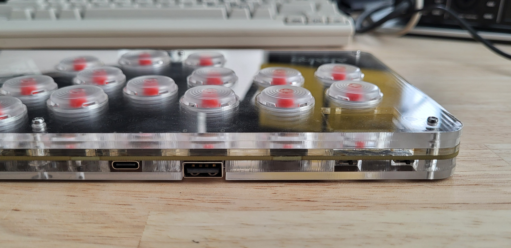

# choco monaka

Fighting game controller

* [abalog.io](https://abalog.io)
* integrated RP2040
* compatible with [GP2040-CE firmware](https://gp2040-ce.info/)
* 18 face buttons
* Kailh Choc hotswap switches (v1 and v2 compatible)
* USB-C
* two slider switches (for e.g. tournament lockout, SOCD)
* USB-A for auth passthrough
* 0.96-in. OLED
* 254 x 127 x 17mm

PCB artwork:

v0.1.0 prototype front:

v0.1.0 prototype back:

v0.1.0 prototype edge:
